# Kutt URL Shortener 기술 아키텍처 다이어그램

## 시스템 아키텍처 개요

### 1. 전체 시스템 구조

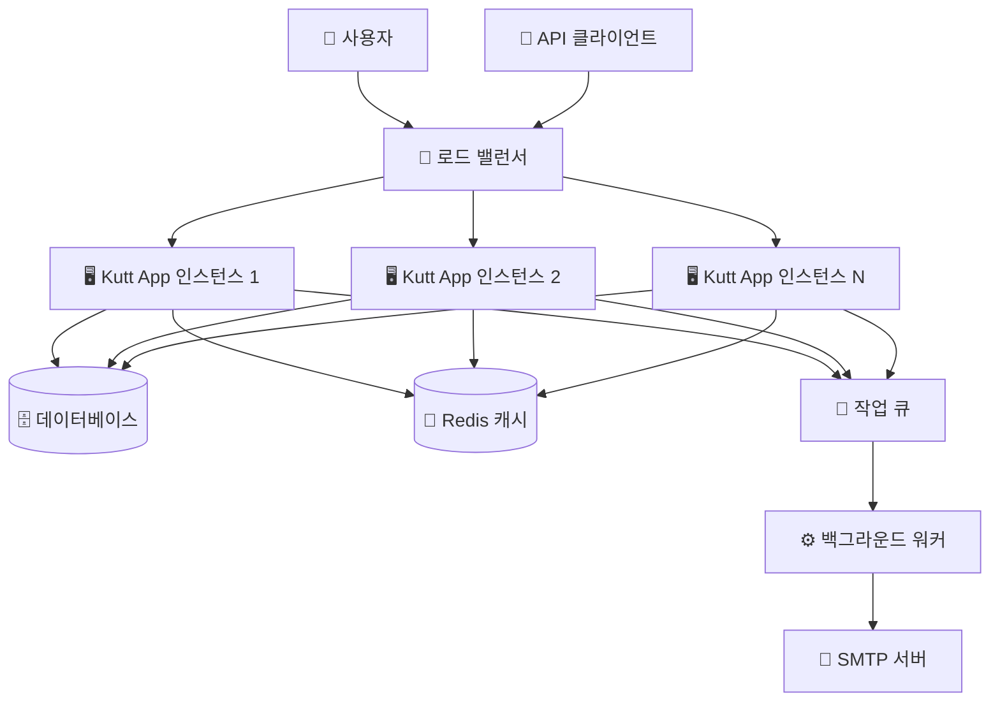

### 2. 애플리케이션 내부 구조

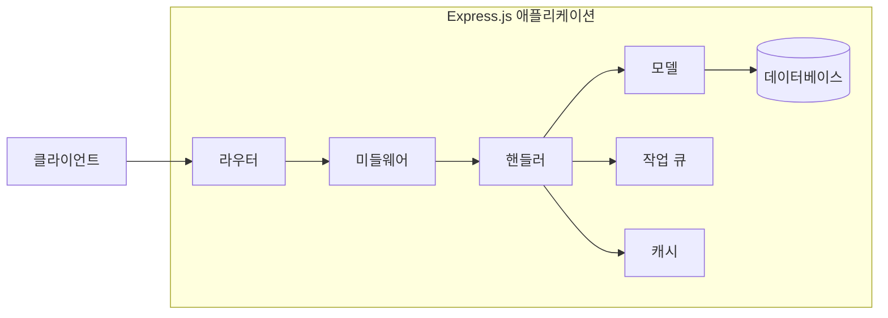

## 데이터 플로우 다이어그램

### 1. URL 단축 플로우

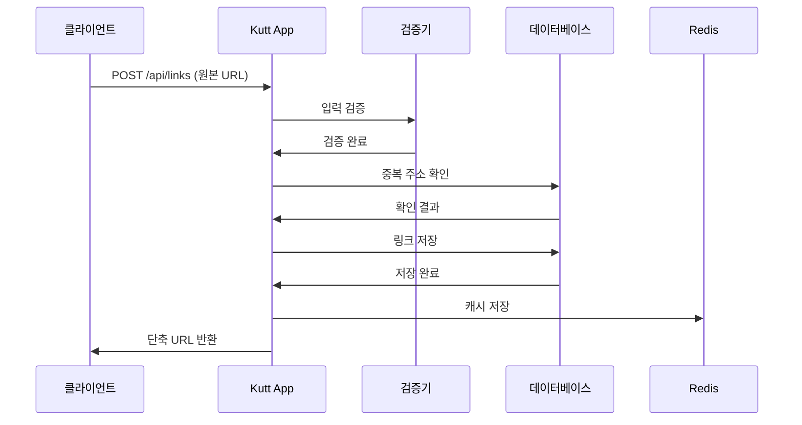

### 2. URL 리디렉션 플로우

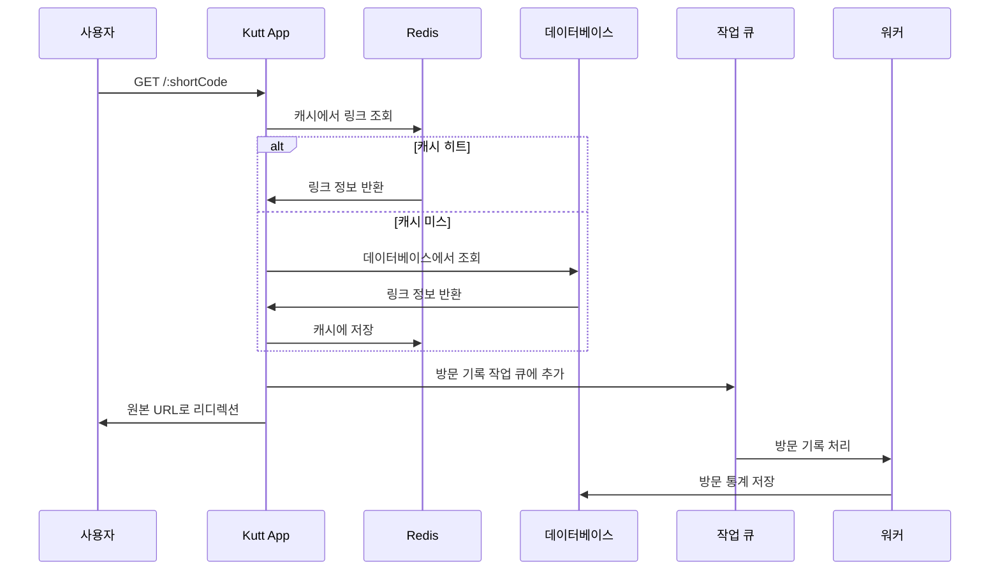

### 3. 사용자 인증 플로우

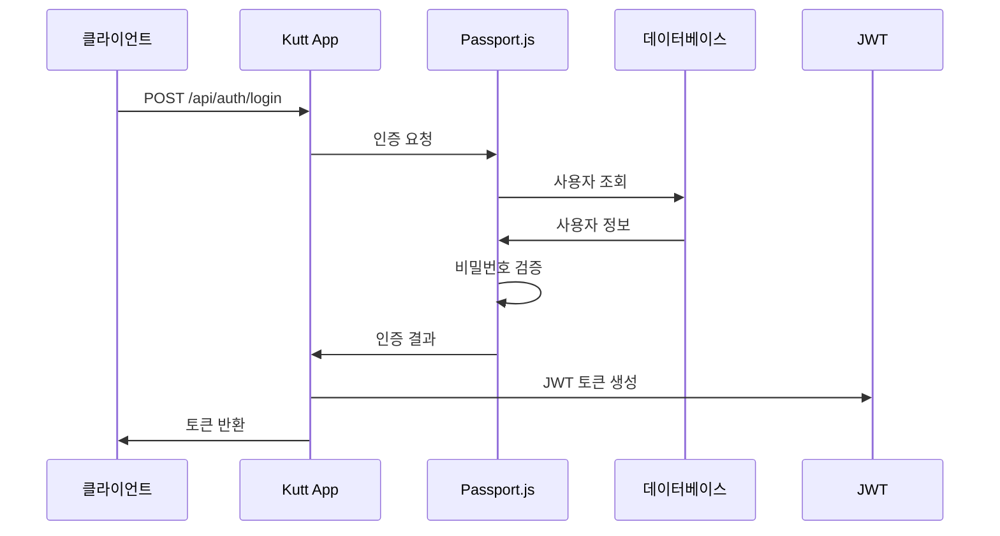

## 컴포넌트 상호작용 다이어그램

### 1. 핸들러 레이어 구조

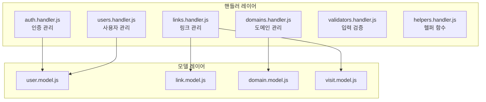

### 2. 라우팅 구조

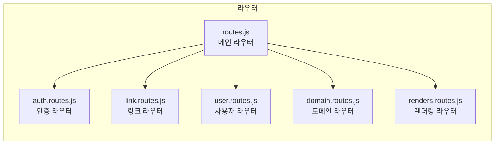

## 데이터베이스 ERD

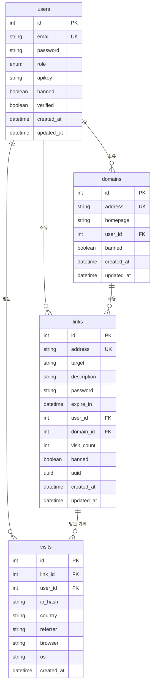

## 보안 아키텍처

### 1. 인증 및 인가 플로우

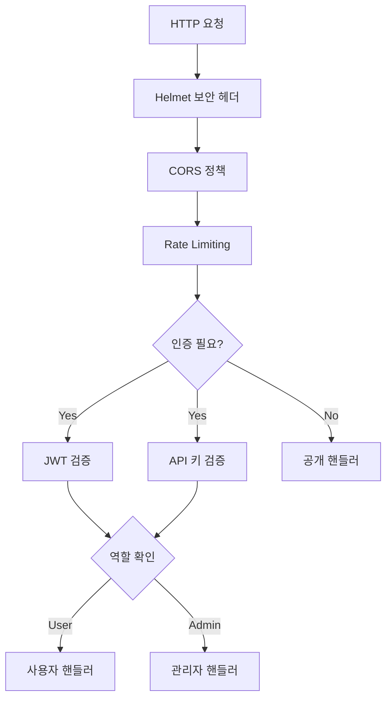

### 2. 데이터 보호 레이어

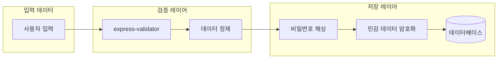

## 성능 최적화 구조

### 1. 캐싱 전략

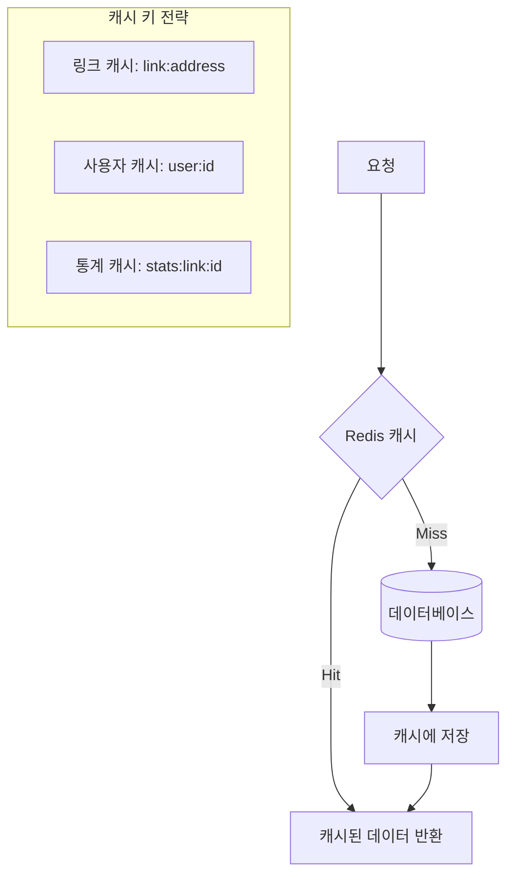

### 2. 비동기 작업 처리

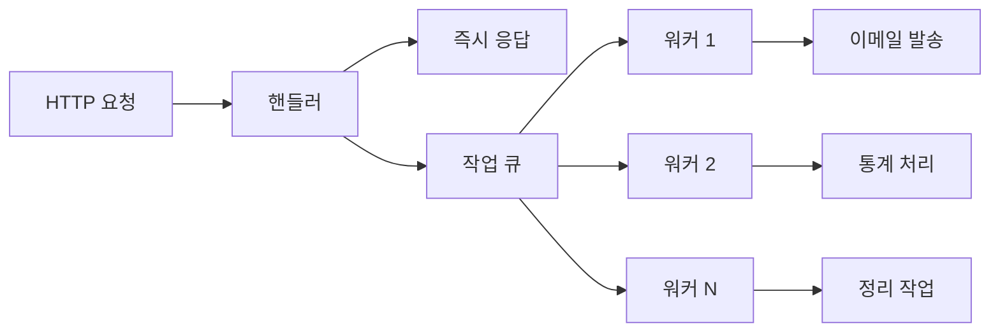

## 배포 아키텍처

### 1. Docker 컨테이너 구조

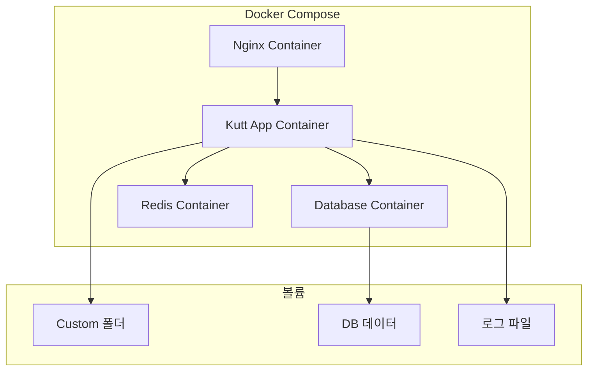

### 2. 스케일링 구조

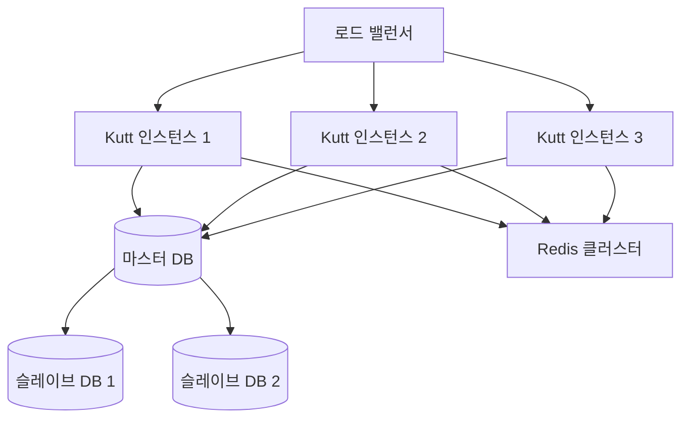

## 모니터링 및 로깅 구조

### 1. 로그 수집 플로우

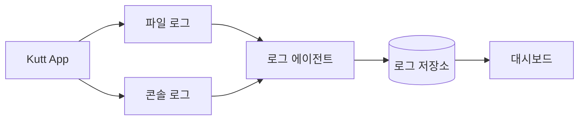

### 2. 메트릭 수집

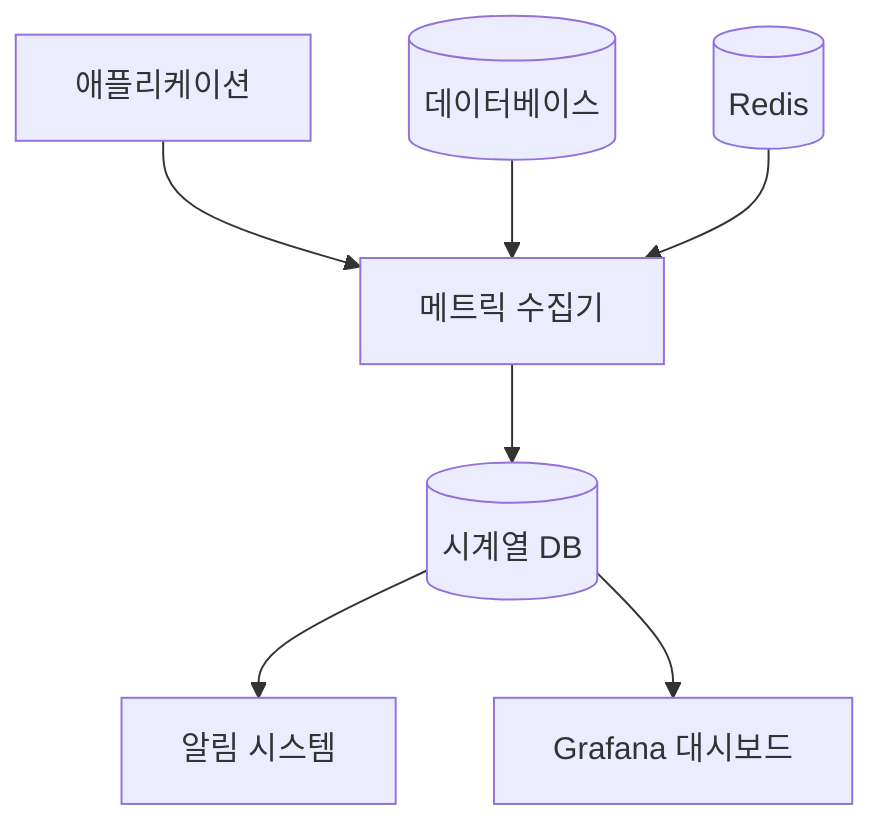

## API 요청 처리 플로우

### 1. RESTful API 구조

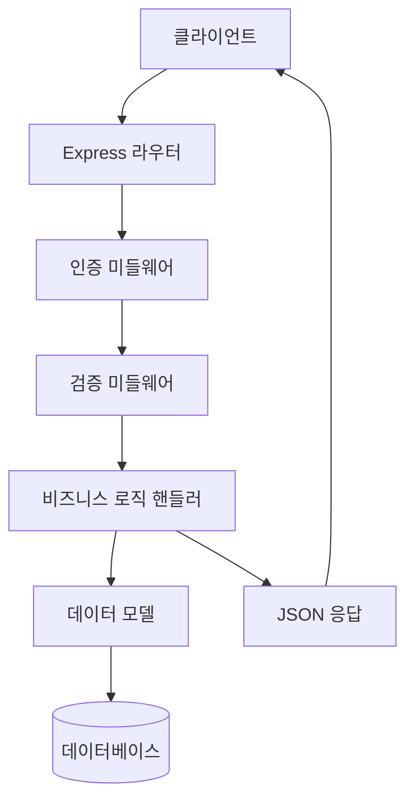

### 2. 에러 처리 플로우

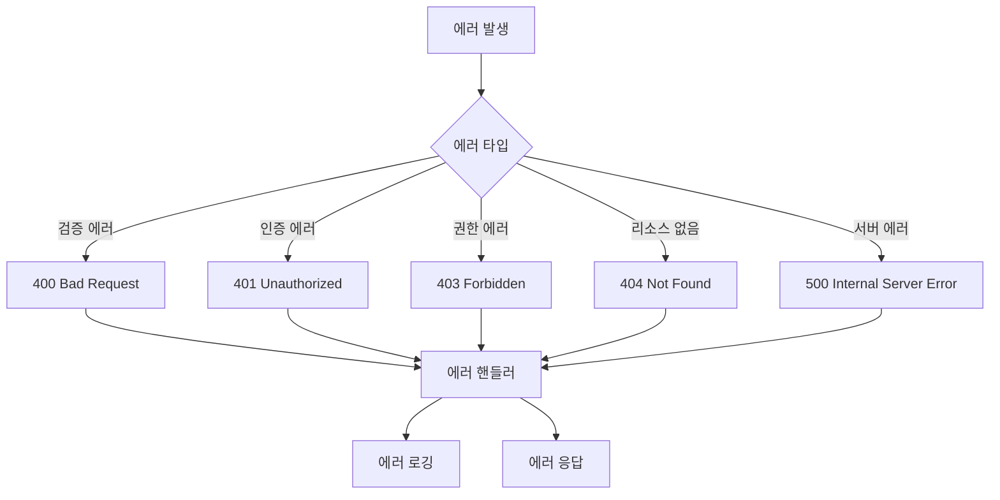

이 아키텍처 다이어그램은 Kutt URL Shortener의 전체적인 기술 구조와 각 컴포넌트 간의 상호작용을 시각적으로 나타냅니다. 시스템의 확장성, 보안성, 성능 최적화 방안을 포함하여 실제 운영 환경에서의 구조를 반영하고 있습니다.