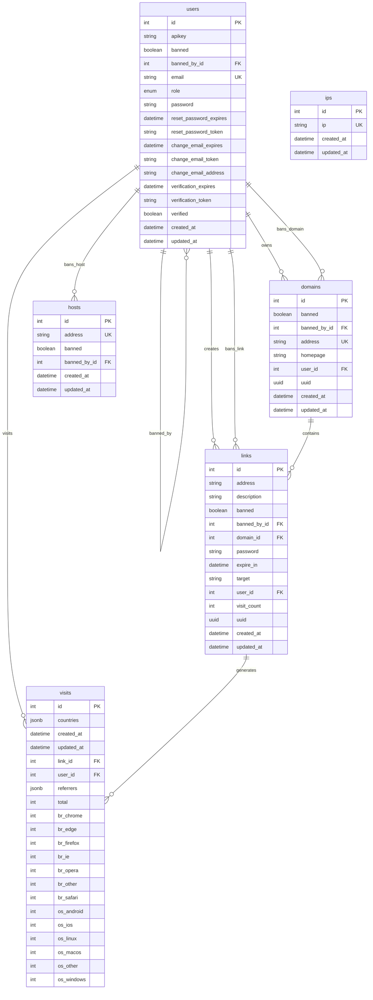

# 데이터베이스 구조 분석

## 개요

본 문서는 URL 단축 서비스의 데이터베이스 구조를 분석하고 각 테이블의 역할과 관계를 설명합니다.

## 전체 ERD (Entity Relationship Diagram)

## 테이블 상세 분석

### 1. users 테이블
사용자 정보를 관리하는 핵심 테이블입니다.

**주요 필드:**
- `id`: 기본 키
- `apikey`: API 인증을 위한 키
- `banned`: 사용자 차단 여부
- `banned_by_id`: 차단한 관리자 ID (자체 참조)
- `email`: 사용자 이메일 (유니크)
- `role`: 사용자 역할 (USER/ADMIN)
- `password`: 암호화된 비밀번호

**인증 관련 필드:**
- `reset_password_*`: 비밀번호 재설정 관련
- `change_email_*`: 이메일 변경 관련
- `verification_*`: 이메일 인증 관련
- `verified`: 이메일 인증 완료 여부

**특징:**
- 자체 참조 관계로 관리자가 다른 사용자를 차단할 수 있음
- 역할 기반 권한 관리 시스템
- 이메일 인증 및 비밀번호 재설정 기능 완비

### 2. domains 테이블
사용자가 소유할 수 있는 커스텀 도메인을 관리합니다.

**주요 필드:**
- `id`: 기본 키
- `address`: 도메인 주소 (유니크)
- `homepage`: 홈페이지 URL
- `user_id`: 도메인 소유자 ID
- `uuid`: 고유 식별자
- `banned`: 도메인 차단 여부
- `banned_by_id`: 차단한 관리자 ID

**특징:**
- 사용자가 삭제되면 `user_id`가 NULL로 설정 (SET NULL)
- 도메인별 차단 기능
- UUID를 통한 추가 식별자 제공

### 3. links 테이블
단축 URL의 핵심 테이블로 모든 링크 정보를 관리합니다.

**주요 필드:**
- `id`: 기본 키
- `address`: 단축 URL 주소
- `target`: 원본 URL (최대 2040자)
- `description`: 링크 설명
- `user_id`: 링크 생성자 ID
- `domain_id`: 사용된 도메인 ID
- `visit_count`: 방문 횟수
- `password`: 비밀번호 보호
- `expire_in`: 만료 시간
- `uuid`: 고유 식별자

**특징:**
- 사용자가 삭제되면 링크도 함께 삭제 (CASCADE)
- 도메인과 연결하여 커스텀 도메인 사용 가능
- 비밀번호 보호 및 만료 시간 설정 가능
- 방문 횟수 실시간 추적

### 4. visits 테이블
링크 방문 통계 데이터를 상세하게 저장합니다.

**주요 필드:**
- `id`: 기본 키
- `link_id`: 방문된 링크 ID
- `user_id`: 방문자 ID (로그인 사용자인 경우)
- `total`: 총 방문 횟수

**브라우저 통계:**
- `br_chrome`, `br_edge`, `br_firefox`, `br_ie`
- `br_opera`, `br_safari`, `br_other`

**운영체제 통계:**
- `os_android`, `os_ios`, `os_linux`
- `os_macos`, `os_windows`, `os_other`

**JSON 데이터:**
- `countries`: 국가별 방문 데이터 (JSONB)
- `referrers`: 리퍼러 정보 (JSONB)

**특징:**
- 링크나 사용자가 삭제되면 방문 데이터도 함께 삭제 (CASCADE)
- 브라우저별, OS별 통계 분리 저장
- JSONB 형태로 복합 데이터 저장

### 5. hosts 테이블
차단된 호스트를 관리하여 스팸 방지 기능을 제공합니다.

**주요 필드:**
- `id`: 기본 키
- `address`: 호스트 주소 (유니크)
- `banned`: 차단 여부
- `banned_by_id`: 차단한 관리자 ID

**특징:**
- 스팸 방지 목적으로 사용
- 관리자가 특정 호스트를 차단할 수 있음

### 6. ips 테이블
IP 주소를 관리합니다.

**주요 필드:**
- `id`: 기본 키
- `ip`: IP 주소 (유니크)

**특징:**
- 차단 목적 또는 통계 목적으로 사용
- 단순한 구조로 IP 주소만 저장

## 주요 관계

### 1. 사용자 중심의 관계
- **users → domains**: 사용자가 여러 도메인을 소유할 수 있음
- **users → links**: 사용자가 여러 링크를 생성할 수 있음
- **users → visits**: 로그인 사용자의 방문 기록 추적

### 2. 관리자 권한 관계
- **users → users**: 관리자가 다른 사용자를 차단
- **users → domains**: 관리자가 도메인을 차단
- **users → links**: 관리자가 링크를 차단
- **users → hosts**: 관리자가 호스트를 차단

### 3. 서비스 로직 관계
- **domains → links**: 도메인이 링크에 사용됨
- **links → visits**: 링크 방문 시 통계 생성

## 데이터베이스 설계 특징

### 1. 확장성
- UUID 사용으로 분산 환경에서의 고유성 보장
- JSONB 사용으로 유연한 데이터 구조 지원

### 2. 보안성
- 자체 참조를 통한 관리자 권한 관리
- 각 테이블별 차단 기능 제공
- 비밀번호 보호 링크 지원

### 3. 통계 분석
- 상세한 방문 통계 데이터 수집
- 브라우저, OS, 국가별 분석 가능
- 실시간 방문 횟수 추적

### 4. 사용자 경험
- 커스텀 도메인 지원
- 링크 만료 시간 설정
- 상세한 링크 설명 지원

이 데이터베이스 구조는 완전한 URL 단축 서비스를 지원하며, 사용자 관리, 통계 분석, 보안 기능을 모두 갖추고 있습니다. 